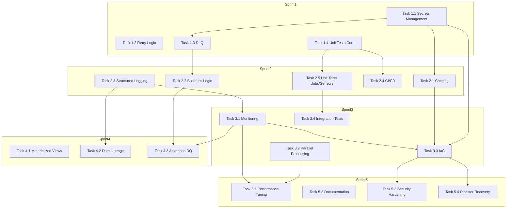

# GitHub Projects Roadmap - Bike Data Flow

**Last reviewed: 2026-01-10**

---

## Executive Summary

This document provides a comprehensive GitHub Projects roadmap for the bike-data-flow project, a Dagster-based data pipeline for processing Wrocław bike station data. The roadmap is organized into 4 priority levels (Critical, High, Medium, Low) spanning 7+ weeks of implementation work.

**GitHub Projects Layout Types:**
- **Table Layout** - High-density spreadsheet view for managing backlogs
- **Board Layout** - Kanban-style board for tracking work in progress
- **Roadmap Layout** - Timeline view for visualizing work over time

**Current State:**
- 7 assets implemented (raw data fetching, processing, enhancement, DuckDB views, spatial analysis)
- 1 job (stations processing)
- 1 sensor (30-second polling)
- 7 resources (S3, DuckDB, PostgreSQL)
- 2 schemas (Pandera validation)
- Partial test coverage

**Target State:**
- Secure secrets management
- Resilient pipeline with retry logic and DLQ
- Comprehensive test coverage (80%+)
- Production-ready CI/CD
- Full observability stack
- Infrastructure as Code

---

## Project Board Structure

### Main Board: Bike Data Flow Pipeline Improvements

The GitHub Projects board will be organized with the following swimlanes (Status fields):

```
┌─────────────────────────────────────────────────────────────────────────────┐
│                           GITHUB PROJECTS BOARD                             │
├─────────────────────────────────────────────────────────────────────────────┤
│                                                                             │
│  ┌─────────────┐  ┌─────────────┐  ┌─────────────┐  ┌─────────────┐        │
│  │   BACKLOG   │  │   TODO      │  │ IN PROGRESS │  │    DONE     │        │
│  │             │  │             │  │             │  │             │        │
│  │ - Tasks     │  │ - Tasks     │  │ - Tasks     │  │ - Tasks     │        │
│  │   awaiting  │  │   ready to  │  │   actively  │  │   completed │        │
│  │   work      │  │   start     │  │   working   │  │             │        │
│  └─────────────┘  └─────────────┘  └─────────────┘  └─────────────┘        │
│                                                                             │
│  ┌─────────────┐  ┌─────────────┐                                            │
│  │  BLOCKED    │  │  CANCELLED  │                                            │
│  │             │  │             │                                            │
│  │ - Tasks     │  │ - Tasks     │                                            │
│  │   blocked   │  │   cancelled  │                                            │
│  │   by deps   │  │   or out of │                                            │
│  │             │  │   scope     │                                            │
│  └─────────────┘  └─────────────┘                                            │
│                                                                             │
└─────────────────────────────────────────────────────────────────────────────┘
```

### Field Definitions

| Field Name | Type | Values | Description |
|------------|------|--------|-------------|
| **Status** | Single select | Backlog, Todo, In Progress, In Review, Done, Blocked, Cancelled | Current task status |
| **Priority** | Single select | Critical, High, Medium, Low | Task priority level |
| **Type** | Single select | Feature, Bug, Refactor, Test, Docs, Infrastructure | Task type |
| **Component** | Single select | Pipeline, Assets, Jobs, Sensors, Resources, Infrastructure, Monitoring, CI/CD | Affected component |
| **Assignee** | Person | - | Task owner |
| **Iteration** | Iteration | Sprint 1, Sprint 2, Sprint 3, Sprint 4, Sprint 5+ | Time block for planning work |
| **Start Date** | Date | - | When work should begin |
| **Target Date** | Date | - | When work should be completed |
| **Estimate** | Number | - | Estimated effort in hours |
| **Notes** | Text | - | Quick notes or blockers |

### Labels

| Label | Color | Description |
|-------|-------|-------------|
| `priority:critical` | `d73a4a` | Critical priority tasks |
| `priority:high` | `fbca04` | High priority tasks |
| `priority:medium` | `fef2c0` | Medium priority tasks |
| `priority:low` | `0075ca` | Low priority tasks |
| `type:feature` | `5319e7` | New feature implementation |
| `type:bug` | `d73a4a` | Bug fix |
| `type:refactor` | `128a0c` | Code refactoring |
| `type:test` | `006b75` | Test implementation |
| `type:docs` | `7057ff` | Documentation |
| `type:infrastructure` | `5319e7` | Infrastructure changes |
| `component:pipeline` | `006b75` | Pipeline-related |
| `component:assets` | `b60205` | Asset-related |
| `component:jobs` | `d4c5f9` | Job-related |
| `component:sensors` | `e99695` | Sensor-related |
| `component:resources` | `7057ff` | Resource-related |
| `component:monitoring` | `fbca04` | Monitoring-related |
| `component:ci-cd` | `ff7b72` | CI/CD-related |
| `dependency:blocked` | `b60205` | Blocked by dependency |
| `dependency:blocks` | `d93f0b` | Blocks other tasks |
| `iteration:sprint-1` | `e99695` | Sprint 1 tasks |
| `iteration:sprint-2` | `e99695` | Sprint 2 tasks |
| `iteration:sprint-3` | `e99695` | Sprint 3 tasks |
| `iteration:sprint-4` | `e99695` | Sprint 4 tasks |
| `iteration:sprint-5` | `e99695` | Sprint 5+ tasks |

---

## Milestone Planning

### Sprint 1 (Weeks 1-2): Critical Foundation

**Goal:** Establish secure and resilient pipeline foundation

**Tasks:**
- Secrets Management (HashiCorp Vault)
- Retry Logic Implementation
- Dead Letter Queue (DLQ)
- Unit Tests - Core Assets

**Target Date:** Sprint 1 completion

### Sprint 2 (Weeks 3-4): Production Readiness

**Goal:** Add caching, validation, and CI/CD

**Tasks:**
- Caching Layer (Redis)
- Business Logic Validation
- Structured Logging (structlog)
- CI/CD Pipeline (GitHub Actions)
- Unit Tests - Jobs and Sensors

**Target Date:** Sprint 2 completion

### Sprint 3 (Weeks 5-6): Observability & Performance

**Goal:** Implement monitoring and parallel processing

**Tasks:**
- Monitoring & Observability (Prometheus + Grafana)
- Parallel Processing (multiprocessing/Dask)
- Infrastructure as Code (Ansible)
- Integration Tests

**Target Date:** Sprint 3 completion

### Sprint 4 (Weeks 7-8): Advanced Features

**Goal:** Add materialized views and data lineage

**Tasks:**
- Materialized Views (DuckDB)
- Data Lineage Tracking
- Advanced Data Quality (Great Expectations)

**Target Date:** Sprint 4 completion

### Sprint 5+ (Weeks 9+): Optimization & Polish

**Goal:** Performance optimization and documentation

**Tasks:**
- Performance tuning
- Documentation updates
- Security hardening
- Disaster recovery procedures

**Target Date:** Sprint 5+ completion

---

## Detailed Task Breakdown

### Critical Priority (Sprint 1)

#### Task 1.1: Secrets Management - HashiCorp Vault

**Title:** Implement HashiCorp Vault for secure secrets management

**Description:**
Replace environment variables and `.env` files with HashiCorp Vault for secure secrets storage. Configure Vault on Hetzner VPS and integrate with Dagster resources.

**Acceptance Criteria:**
- [ ] HashiCorp Vault installed and running on Hetzner VPS
- [ ] Vault configured with KV secrets engine
- [ ] All S3 credentials migrated to Vault
- [ ] Dagster VaultResource implemented
- [ ] All assets updated to use Vault for credentials
- [ ] `.env` files removed from version control
- [ ] `.env*` added to `.gitignore`
- [ ] Vault access policies configured
- [ ] Vault unseal procedures documented

**Dependencies:** None

**Estimated Effort:** 16-24 hours

**Assignee:** TBD

**Labels:**
- `priority:critical`
- `type:infrastructure`
- `component:resources`
- `iteration:sprint-1`

**Iteration:** Sprint 1
**Start Date:** TBD
**Target Date:** TBD

---

#### Task 1.2: Retry Logic - Exponential Backoff

**Title:** Implement exponential backoff retry logic with circuit breaker

**Description:**
Add retry logic with exponential backoff for transient failures (network timeouts, S3 rate limits). Implement circuit breaker pattern for repeated failures.

**Acceptance Criteria:**
- [ ] Tenacity library integrated
- [ ] Custom retry decorator for S3 operations implemented
- [ ] Custom retry decorator for API calls implemented
- [ ] Circuit breaker pattern implemented
- [ ] Retry logic applied to `wrm_stations_raw_data_asset`
- [ ] Retry logic applied to all S3 upload operations
- [ ] Retry logic applied to all S3 download operations
- [ ] Retry configuration documented
- [ ] Unit tests for retry logic

**Dependencies:** None

**Estimated Effort:** 8-16 hours

**Assignee:** TBD

**Labels:**
- `priority:critical`
- `type:feature`
- `component:assets`
- `iteration:sprint-1`

**Iteration:** Sprint 1
**Start Date:** TBD
**Target Date:** TBD

---

#### Task 1.3: Dead Letter Queue (DLQ)

**Title:** Implement Dead Letter Queue for failed records

**Description:**
Create DLQ mechanism to store failed records for later analysis and reprocessing. Implement DLQ structure in Hetzner S3 and create reprocessing job.

**Acceptance Criteria:**
- [ ] DLQ asset implemented
- [ ] DLQ S3 structure created (`bike-data/gen_info/dlq/dt=YYYY-MM-DD/`)
- [ ] DLQ record schema defined
- [ ] Failed records automatically routed to DLQ
- [ ] DLQ metadata captured (timestamp, error type, stack trace)
- [ ] Reprocessing job implemented
- [ ] DLQ monitoring dashboard created
- [ ] DLQ cleanup procedures documented
- [ ] Unit tests for DLQ functionality

**Dependencies:** Task 1.1 (Secrets Management)

**Estimated Effort:** 16-24 hours

**Assignee:** TBD

**Labels:**
- `priority:critical`
- `type:feature`
- `component:assets`
- `component:jobs`
- `iteration:sprint-1`

**Iteration:** Sprint 1
**Start Date:** TBD
**Target Date:** TBD

---

#### Task 1.4: Unit Tests - Core Assets

**Title:** Implement unit tests for core assets (80%+ coverage)

**Description:**
Create comprehensive unit test suite for all assets, jobs, and sensors. Achieve 80%+ code coverage.

**Acceptance Criteria:**
- [ ] Test directory structure created
- [ ] Unit tests for `wrm_stations_raw_data_asset`
- [ ] Unit tests for `wrm_stations_processed_data_all`
- [ ] Unit tests for `wrm_stations_enhanced_data_all`
- [ ] Unit tests for DuckDB analytics assets
- [ ] Mock fixtures for S3 client
- [ ] Mock fixtures for API responses
- [ ] Sample test data created
- [ ] Coverage report generation configured
- [ ] Coverage threshold set to 80%
- [ ] CI/CD integration for tests

**Dependencies:** None

**Estimated Effort:** 24-40 hours

**Assignee:** TBD

**Labels:**
- `priority:critical`
- `type:test`
- `component:assets`
- `iteration:sprint-1`

**Iteration:** Sprint 1
**Start Date:** TBD
**Target Date:** TBD

---

### High Priority (Sprint 2)

#### Task 2.1: Caching Layer - Redis

**Title:** Implement Redis caching layer

**Description:**
Add Redis caching to reduce repeated S3 calls and cache intermediate results. Configure Redis on Hetzner VPS and integrate with Dagster.

**Acceptance Criteria:**
- [ ] Redis installed and running on Hetzner VPS
- [ ] Redis configuration optimized (max memory, eviction policy)
- [ ] Dagster RedisCacheResource implemented
- [ ] Cache key strategy defined
- [ ] TTL configuration implemented
- [ ] Caching applied to frequently accessed assets
- [ ] Cache invalidation strategy implemented
- [ ] Cache hit rate metrics tracked
- [ ] Unit tests for caching logic

**Dependencies:** Task 1.1 (Secrets Management)

**Estimated Effort:** 16-24 hours

**Assignee:** TBD

**Labels:**
- `priority:high`
- `type:feature`
- `component:resources`
- `component:assets`
- `iteration:sprint-2`

**Iteration:** Sprint 2
**Start Date:** TBD
**Target Date:** TBD

---

#### Task 2.2: Business Logic Validation

**Title:** Implement business logic validation layer

**Description:**
Add business rules validation beyond schema validation. Validate coordinates, bike counts, and timestamp sequences.

**Acceptance Criteria:**
- [ ] BusinessLogicValidator class implemented
- [ ] Station coordinates validation (Wrocław bounds)
- [ ] Bike counts validation (non-negative, within total docks)
- [ ] Timestamp sequence validation (chronological order)
- [ ] Enhanced Pandera schema with business logic
- [ ] Validation errors logged to DLQ
- [ ] Validation metrics tracked
- [ ] Unit tests for all validation rules

**Dependencies:** Task 1.3 (DLQ)

**Estimated Effort:** 16-24 hours

**Assignee:** TBD

**Labels:**
- `priority:high`
- `type:feature`
- `component:assets`
- `iteration:sprint-2`

**Iteration:** Sprint 2
**Start Date:** TBD
**Target Date:** TBD

---

#### Task 2.3: Structured Logging - structlog

**Title:** Implement structured logging with correlation IDs

**Description:**
Replace basic logging with structured logging using structlog. Add correlation IDs for request tracing.

**Acceptance Criteria:**
- [ ] structlog library integrated
- [ ] StructlogResource implemented
- [ ] Correlation ID generation implemented
- [ ] Log format configured (JSON)
- [ ] Log levels properly configured
- [ ] Context binding implemented
- [ ] Error logging with stack traces
- [ ] Performance logging (duration, record counts)
- [ ] Log aggregation configured

**Dependencies:** None

**Estimated Effort:** 8-16 hours

**Assignee:** TBD

**Labels:**
- `priority:high`
- `type:feature`
- `component:resources`
- `iteration:sprint-2`

**Iteration:** Sprint 2
**Start Date:** TBD
**Target Date:** TBD

---

#### Task 2.4: CI/CD Pipeline - GitHub Actions

**Title:** Implement CI/CD pipeline with GitHub Actions

**Description:**
Create automated CI/CD pipeline for testing and deployment to Hetzner VPS.

**Acceptance Criteria:**
- [ ] GitHub Actions workflow created
- [ ] Python version configured (3.11)
- [ ] Dependency installation step
- [ ] Unit test execution step
- [ ] Coverage reporting step
- [ ] Codecov integration
- [ ] Deployment to Hetzner VPS step
- [ ] SSH key management via GitHub Secrets
- [ ] Deployment on main branch merge
- [ ] Rollback procedure documented

**Dependencies:** Task 1.4 (Unit Tests)

**Estimated Effort:** 16-24 hours

**Assignee:** TBD

**Labels:**
- `priority:high`
- `type:infrastructure`
- `component:ci-cd`
- `iteration:sprint-2`

**Iteration:** Sprint 2
**Start Date:** TBD
**Target Date:** TBD

---

#### Task 2.5: Unit Tests - Jobs and Sensors

**Title:** Implement unit tests for jobs and sensors

**Description:**
Extend unit test coverage to jobs and sensors. Complete test suite to 80%+ coverage.

**Acceptance Criteria:**
- [ ] Unit tests for `wrm_stations_processing_job`
- [ ] Unit tests for `wrm_stations_raw_data_sensor`
- [ ] Mock fixtures for Dagster context
- [ ] Mock fixtures for S3 list operations
- [ ] Sensor cursor state testing
- [ ] Job trigger logic testing
- [ ] Integration with CI/CD pipeline
- [ ] Coverage report updated

**Dependencies:** Task 1.4 (Unit Tests - Core Assets)

**Estimated Effort:** 16-24 hours

**Assignee:** TBD

**Labels:**
- `priority:high`
- `type:test`
- `component:jobs`
- `component:sensors`
- `iteration:sprint-2`

**Iteration:** Sprint 2
**Start Date:** TBD
**Target Date:** TBD

---

### Medium Priority (Sprint 3)

#### Task 3.1: Monitoring & Observability - Prometheus + Grafana

**Title:** Implement monitoring and observability stack

**Description:**
Deploy Prometheus and Grafana for metrics collection and visualization. Create dashboards for pipeline health.

**Acceptance Criteria:**
- [ ] Prometheus installed and configured
- [ ] Grafana installed and configured
- [ ] Prometheus client library integrated
- [ ] Asset run metrics (Counter, Histogram)
- [ ] Asset duration metrics
- [ ] Error rate metrics
- [ ] S3 operation metrics
- [ ] Grafana dashboards created
- [ ] Alert rules configured
- [ ] Metrics retention policy defined

**Dependencies:** Task 2.3 (Structured Logging)

**Estimated Effort:** 24-32 hours

**Assignee:** TBD

**Labels:**
- `priority:medium`
- `type:feature`
- `component:monitoring`
- `iteration:sprint-3`

**Iteration:** Sprint 3
**Start Date:** TBD
**Target Date:** TBD

---

#### Task 3.2: Parallel Processing - multiprocessing/Dask

**Title:** Implement parallel processing for large datasets

**Description:**
Add parallel processing capabilities using multiprocessing or Dask for improved performance on large datasets.

**Acceptance Criteria:**
- [ ] Parallel processing strategy selected (multiprocessing or Dask)
- [ ] Parallel file processing implemented
- [ ] Worker pool configuration
- [ ] Error handling for parallel tasks
- [ ] Memory usage optimization
- [ ] Performance benchmarks created
- [ ] Unit tests for parallel logic
- [ ] Documentation for parallel processing

**Dependencies:** None

**Estimated Effort:** 16-24 hours

**Assignee:** TBD

**Labels:**
- `priority:medium`
- `type:feature`
- `component:assets`
- `iteration:sprint-3`

**Iteration:** Sprint 3
**Start Date:** TBD
**Target Date:** TBD

---

#### Task 3.3: Infrastructure as Code - Ansible

**Title:** Implement Infrastructure as Code with Ansible

**Description:**
Create Ansible playbooks for reproducible infrastructure provisioning on Hetzner VPS.

**Acceptance Criteria:**
- [ ] Ansible playbook created
- [ ] System dependencies installation task
- [ ] Dagster user creation task
- [ ] Repository clone task
- [ ] Python dependencies installation task
- [ ] Systemd service configuration task
- [ ] Redis installation task
- [ ] Vault installation task
- [ ] Prometheus/Grafana installation task
- [ ] Playbook tested on fresh VPS
- [ ] Documentation for running playbook

**Dependencies:** Task 1.1 (Secrets Management), Task 2.1 (Caching), Task 3.1 (Monitoring)

**Estimated Effort:** 16-24 hours

**Assignee:** TBD

**Labels:**
- `priority:medium`
- `type:infrastructure`
- `component:ci-cd`
- `iteration:sprint-3`

**Iteration:** Sprint 3
**Start Date:** TBD
**Target Date:** TBD

---

#### Task 3.4: Integration Tests

**Title:** Implement integration tests for end-to-end pipeline

**Description:**
Create integration tests that verify the entire pipeline from data ingestion to analytics.

**Acceptance Criteria:**
- [ ] Integration test framework set up
- [ ] End-to-end pipeline test
- [ ] S3 integration test
- [ ] DuckDB integration test
- [ ] Sensor trigger test
- [ ] Job execution test
- [ ] DLQ reprocessing test
- [ ] Test data cleanup procedures
- [ ] Integration with CI/CD pipeline

**Dependencies:** Task 1.4 (Unit Tests), Task 2.5 (Unit Tests - Jobs/Sensors)

**Estimated Effort:** 16-24 hours

**Assignee:** TBD

**Labels:**
- `priority:medium`
- `type:test`
- `component:pipeline`
- `iteration:sprint-3`

**Iteration:** Sprint 3
**Start Date:** TBD
**Target Date:** TBD

---

### Low Priority (Sprint 4)

#### Task 4.1: Materialized Views - DuckDB

**Title:** Implement materialized views for common queries

**Description:**
Create DuckDB materialized views for frequently executed queries to improve performance.

**Acceptance Criteria:**
- [ ] Materialized view for station latest state
- [ ] Materialized view for daily aggregates
- [ ] Materialized view for spatial analysis
- [ ] Refresh strategy implemented
- [ ] Automated refresh job created
- [ ] Performance benchmarks created
- [ ] Documentation for materialized views

**Dependencies:** None

**Estimated Effort:** 8-16 hours

**Assignee:** TBD

**Labels:**
- `priority:low`
- `type:feature`
- `component:assets`
- `iteration:sprint-4`

**Iteration:** Sprint 4
**Start Date:** TBD
**Target Date:** TBD

---

#### Task 4.2: Data Lineage Tracking

**Title:** Implement data lineage tracking

**Description:**
Track data transformations through the pipeline for auditability and debugging.

**Acceptance Criteria:**
- [ ] LineageTracker class implemented
- [ ] Upstream asset tracking
- [ ] Transformation tracking
- [ ] Output metadata tracking
- [ ] Lineage storage in S3
- [ ] Lineage visualization in Dagster UI
- [ ] Lineage query interface
- [ ] Unit tests for lineage tracking

**Dependencies:** Task 2.3 (Structured Logging)

**Estimated Effort:** 16-24 hours

**Assignee:** TBD

**Labels:**
- `priority:low`
- `type:feature`
- `component:assets`
- `iteration:sprint-4`

**Iteration:** Sprint 4
**Start Date:** TBD
**Target Date:** TBD

---

#### Task 4.3: Advanced Data Quality - Great Expectations

**Title:** Implement advanced data quality checks with Great Expectations

**Description:**
Add anomaly detection and data profiling using Great Expectations.

**Acceptance Criteria:**
- [ ] Great Expectations integrated
- [ ] Expectation suite created
- [ ] Data profiling implemented
- [ ] Anomaly detection (Isolation Forest)
- [ ] DQ metrics dashboard
- [ ] DQ alerting
- [ ] DQ report generation
- [ ] Unit tests for DQ checks

**Dependencies:** Task 2.2 (Business Logic Validation), Task 3.1 (Monitoring)

**Estimated Effort:** 24-32 hours

**Assignee:** TBD

**Labels:**
- `priority:low`
- `type:feature`
- `component:assets`
- `component:monitoring`
- `iteration:sprint-4`

**Iteration:** Sprint 4
**Start Date:** TBD
**Target Date:** TBD

---

### Additional Tasks (Sprint 5+)

#### Task 5.1: Performance Tuning

**Title:** Optimize pipeline performance

**Description:**
Identify and optimize performance bottlenecks in the pipeline.

**Acceptance Criteria:**
- [ ] Performance profiling completed
- [ ] Bottlenecks identified
- [ ] Optimization strategies implemented
- [ ] Benchmark comparisons created
- [ ] Performance targets defined
- [ ] Continuous performance monitoring

**Dependencies:** Task 3.2 (Parallel Processing), Task 3.1 (Monitoring)

**Estimated Effort:** 16-24 hours

**Assignee:** TBD

**Labels:**
- `priority:low`
- `type:refactor`
- `component:pipeline`
- `iteration:sprint-5`

**Iteration:** Sprint 5+
**Start Date:** TBD
**Target Date:** TBD

---

#### Task 5.2: Documentation Updates

**Title:** Update and improve project documentation

**Description:**
Ensure all documentation is up-to-date and comprehensive.

**Acceptance Criteria:**
- [ ] README updated with new features
- [ ] API documentation generated
- [ ] Architecture diagrams updated
- [ ] Deployment guide updated
- [ ] Troubleshooting guide created
- [ ] Contributor guide updated

**Dependencies:** All previous tasks

**Estimated Effort:** 8-16 hours

**Assignee:** TBD

**Labels:**
- `priority:low`
- `type:docs`
- `component:pipeline`
- `iteration:sprint-5`

**Iteration:** Sprint 5+
**Start Date:** TBD
**Target Date:** TBD

---

#### Task 5.3: Security Hardening

**Title:** Implement additional security measures

**Description:**
Add security hardening measures to protect the pipeline and data.

**Acceptance Criteria:**
- [ ] Security audit completed
- [ ] Vulnerabilities addressed
- [ ] Firewall rules configured
- [ ] Fail2ban configured
- [ ] SSH hardening implemented
- [ ] Data encryption at rest
- [ ] Data encryption in transit
- [ ] Security monitoring implemented

**Dependencies:** Task 1.1 (Secrets Management), Task 3.3 (IaC)

**Estimated Effort:** 16-24 hours

**Assignee:** TBD

**Labels:**
- `priority:low`
- `type:infrastructure`
- `component:ci-cd`
- `iteration:sprint-5`

**Iteration:** Sprint 5+
**Start Date:** TBD
**Target Date:** TBD

---

#### Task 5.4: Disaster Recovery Procedures

**Title:** Implement disaster recovery procedures

**Description:**
Create and document disaster recovery procedures for the pipeline.

**Acceptance Criteria:**
- [ ] Backup strategy implemented
- [ ] Automated backup scripts created
- [ ] Backup retention policy defined
- [ ] Restore procedures documented
- [ ] Recovery time objectives defined
- [ ] Recovery point objectives defined
- [ ] Disaster recovery testing completed
- [ ] Incident response plan created

**Dependencies:** Task 3.3 (IaC)

**Estimated Effort:** 16-24 hours

**Assignee:** TBD

**Labels:**
- `priority:low`
- `type:infrastructure`
- `component:ci-cd`
- `iteration:sprint-5`

**Iteration:** Sprint 5+
**Start Date:** TBD
**Target Date:** TBD

---

#### Task 5.5: API Rate Limiting

**Title:** Implement API rate limiting and throttling

**Description:**
Handle external API rate limits gracefully to prevent throttling and ensure reliable data fetching.

**Acceptance Criteria:**
- [ ] Rate limiting library integrated
- [ ] Request throttling implemented
- [ ] Rate limit headers parsing
- [ ] Adaptive request timing
- [ ] Backoff strategy on rate limit
- [ ] Metrics for rate limit hits
- [ ] Unit tests for rate limiting

**Dependencies:** Task 1.2 (Retry Logic)

**Estimated Effort:** 8-16 hours

**Assignee:** TBD

**Labels:**
- `priority:low`
- `type:feature`
- `component:assets`
- `iteration:sprint-5`

**Iteration:** Sprint 5+
**Start Date:** TBD
**Target Date:** TBD

---

#### Task 5.6: Data Archival and Purging

**Title:** Implement data lifecycle management with archival and purging

**Description:**
Create automated data archival and purging procedures to manage storage costs and retention policies.

**Acceptance Criteria:**
- [ ] Data retention policy defined
- [ ] Archival strategy implemented (cold storage to S3 Glacier)
- [ ] Purging automation for old data
- [ ] Archive verification checks
- [ ] Recovery procedures for archived data
- [ ] Storage cost optimization
- [ ] Unit tests for archival logic

**Dependencies:** Task 1.1 (Secrets Management), Task 3.3 (IaC)

**Estimated Effort:** 16-24 hours

**Assignee:** TBD

**Labels:**
- `priority:low`
- `type:feature`
- `component:pipeline`
- `iteration:sprint-5`

**Iteration:** Sprint 5+
**Start Date:** TBD
**Target Date:** TBD

---

## Task Dependencies Mapping

### Dependency Graph



### Critical Path

The critical path for the project is:

1. **Task 1.1** (Secrets Management) - Foundation for all secure operations
2. **Task 1.3** (DLQ) - Required for error handling
3. **Task 2.2** (Business Logic Validation) - Data quality foundation
4. **Task 2.3** (Structured Logging) - Required for monitoring
5. **Task 3.1** (Monitoring) - Required for observability
6. **Task 3.3** (IaC) - Required for production deployment

### Dependency Summary

| Task | Blocks | Blocked By |
|------|--------|------------|
| 1.1 Secrets Management | 1.3, 2.1, 3.3, 5.3 | - |
| 1.2 Retry Logic | - | - |
| 1.3 DLQ | 2.2 | 1.1 |
| 1.4 Unit Tests Core | 2.4, 2.5, 3.4 | - |
| 2.1 Caching | 3.3 | 1.1 |
| 2.2 Business Logic | 4.3 | 1.3 |
| 2.3 Structured Logging | 3.1, 4.2 | - |
| 2.4 CI/CD | - | 1.4 |
| 2.5 Unit Tests Jobs/Sensors | 3.4 | 1.4 |
| 3.1 Monitoring | 4.3, 5.1 | 2.3 |
| 3.2 Parallel Processing | 5.1 | - |
| 3.3 IaC | 5.3, 5.4 | 1.1, 2.1, 3.1 |
| 3.4 Integration Tests | - | 1.4, 2.5 |
| 4.1 Materialized Views | - | - |
| 4.2 Data Lineage | - | 2.3 |
| 4.3 Advanced DQ | - | 2.2, 3.1 |
| 5.1 Performance Tuning | - | 3.1, 3.2 |
| 5.2 Documentation | - | All |
| 5.3 Security Hardening | - | 1.1, 3.3 |
| 5.4 Disaster Recovery | - | 3.3 |

---

## GitHub Projects Configuration Guide

### Step 1: Create the Project

1. Navigate to the GitHub repository
2. Click on **Projects** tab
3. Click **New project**
4. Select **Board** template
5. Name the project: **Bike Data Flow Pipeline Improvements**
6. Select repository: **bike-data-flow**
7. Click **Create project**

### Step 2: Configure Fields

Navigate to **Project settings** → **Fields** and add the following fields:

#### Status Field (Single Select)
- **Name:** Status
- **Options:**
  - Backlog
  - Todo
  - In Progress
  - In Review
  - Done
  - Blocked
  - Cancelled

#### Priority Field (Single Select)
- **Name:** Priority
- **Options:**
  - Critical
  - High
  - Medium
  - Low

#### Type Field (Single Select)
- **Name:** Type
- **Options:**
  - Feature
  - Bug
  - Refactor
  - Test
  - Docs
  - Infrastructure

#### Component Field (Single Select)
- **Name:** Component
- **Options:**
  - Pipeline
  - Assets
  - Jobs
  - Sensors
  - Resources
  - Infrastructure
  - Monitoring
  - CI/CD

#### Assignee Field (Person)
- **Name:** Assignee
- **Type:** Person

#### Iteration Field (Iteration)
- **Name:** Iteration
- **Type:** Iteration
- **Duration:** 2 weeks (recommended)
- **Options:**
  - Sprint 1
  - Sprint 2
  - Sprint 3
  - Sprint 4
  - Sprint 5+

#### Start Date Field (Date)
- **Name:** Start Date
- **Type:** Date

#### Target Date Field (Date)
- **Name:** Target Date
- **Type:** Date

#### Estimate Field (Number)
- **Name:** Estimate
- **Type:** Number

#### Notes Field (Text)
- **Name:** Notes
- **Type:** Text

### Step 3: Configure Labels

Navigate to **Repository settings** → **Labels** and add the following labels:

| Label Name | Color | Description |
|------------|-------|-------------|
| `priority:critical` | `d73a4a` | Critical priority tasks |
| `priority:high` | `fbca04` | High priority tasks |
| `priority:medium` | `fef2c0` | Medium priority tasks |
| `priority:low` | `0075ca` | Low priority tasks |
| `type:feature` | `5319e7` | New feature implementation |
| `type:bug` | `d73a4a` | Bug fix |
| `type:refactor` | `128a0c` | Code refactoring |
| `type:test` | `006b75` | Test implementation |
| `type:docs` | `7057ff` | Documentation |
| `type:infrastructure` | `5319e7` | Infrastructure changes |
| `component:pipeline` | `006b75` | Pipeline-related |
| `component:assets` | `b60205` | Asset-related |
| `component:jobs` | `d4c5f9` | Job-related |
| `component:sensors` | `e99695` | Sensor-related |
| `component:resources` | `7057ff` | Resource-related |
| `component:monitoring` | `fbca04` | Monitoring-related |
| `component:ci-cd` | `ff7b72` | CI/CD-related |
| `dependency:blocked` | `b60205` | Blocked by dependency |
| `dependency:blocks` | `d93f0b` | Blocks other tasks |
| `iteration:sprint-1` | `e99695` | Sprint 1 tasks |
| `iteration:sprint-2` | `e99695` | Sprint 2 tasks |
| `iteration:sprint-3` | `e99695` | Sprint 3 tasks |
| `iteration:sprint-4` | `e99695` | Sprint 4 tasks |
| `iteration:sprint-5` | `e99695` | Sprint 5+ tasks |

### Step 4: Configure Views

Navigate to **Project settings** → **Views** and add the following views:

#### Team Backlog View (Table)
- **Name:** Team Backlog
- **Layout:** Table
- **Columns:** Title, Status, Priority, Type, Component, Assignee, Iteration, Start Date, Target Date, Estimate, Notes
- **Group by:** Priority
- **Sort by:** Target Date
- **Show Field Sum:** Estimate (to see total complexity)

#### Iteration Planning View (Board)
- **Name:** Iteration Planning
- **Layout:** Board
- **Filter:** `iteration:@current` to show only current iteration
- **Columns:** Todo, In Progress, In Review, Done
- **Show Field Sum:** Estimate in each column
- **Set column limits** to maintain focus

#### Roadmap View (Timeline)
- **Name:** Roadmap
- **Layout:** Roadmap
- **Group by:** Iteration
- **Sort by:** Start Date
- **Add Markers** for iteration starts
- **Zoom level:** Month or Quarter

#### Sprint Views
Create separate views for each sprint:
- **Sprint 1 View:** Filter by Iteration = Sprint 1
- **Sprint 2 View:** Filter by Iteration = Sprint 2
- **Sprint 3 View:** Filter by Iteration = Sprint 3
- **Sprint 4 View:** Filter by Iteration = Sprint 4
- **Sprint 5+ View:** Filter by Iteration = Sprint 5+

### Step 5: Configure Automation Rules

Navigate to **Project settings** → **Automation** and add the following rules:

#### Rule 1: Auto-move to Todo when assigned
```
When: Assignee is set
Then: Set Status to Todo
```

#### Rule 2: Auto-move to In Progress when first comment
```
When: Comment is added AND Status is Todo
Then: Set Status to In Progress
```

#### Rule 3: Auto-move to In Review when PR opened
```
When: Pull request is opened AND Status is In Progress
Then: Set Status to In Review
```

#### Rule 4: Auto-move to Done when PR merged
```
When: Pull request is merged AND Status is In Review
Then: Set Status to Done
```

#### Rule 5: Auto-label based on priority
```
When: Priority is set to Critical
Then: Add label priority:critical
```
(Repeat for High, Medium, Low)

#### Rule 6: Auto-label based on type
```
When: Type is set to Feature
Then: Add label type:feature
```
(Repeat for Bug, Refactor, Test, Docs, Infrastructure)

#### Rule 7: Auto-label based on component
```
When: Component is set to Assets
Then: Add label component:assets
```
(Repeat for other components)

#### Rule 8: Auto-label based on iteration
```
When: Iteration is set to Sprint 1
Then: Add label iteration:sprint-1
```
(Repeat for Sprint 2, Sprint 3, Sprint 4, Sprint 5+)

#### Rule 9: Auto-archive completed items
```
When: Status is set to Done AND Target Date is more than 30 days ago
Then: Archive item
```

#### Rule 10: Auto-add items with specific labels
```
When: Item has label priority:critical
Then: Add to project Bike Data Flow Pipeline Improvements
```

### Step 6: Create Issues

Create GitHub issues for each task defined in the **Detailed Task Breakdown** section. Each issue should include:

- **Title:** Task title
- **Description:** Task description, acceptance criteria, dependencies
- **Labels:** Priority, Type, Component, Iteration labels
- **Assignee:** TBD (or assign to team member)
- **Iteration:** Sprint iteration
- **Start Date:** TBD
- **Target Date:** TBD
- **Estimate:** Estimated hours
- **Project:** Add to the Bike Data Flow Pipeline Improvements project

### Step 7: Set Up Iterations

Navigate to **Project settings** → **Iterations** and create the following iterations:

| Iteration | Duration | Start Date | End Date | Description |
|-----------|----------|------------|-----------|-------------|
| Sprint 1 | 2 weeks | TBD | TBD | Critical Foundation - Secrets, Retry, DLQ, Unit Tests |
| Sprint 2 | 2 weeks | TBD | TBD | Production Readiness - Caching, Validation, Logging, CI/CD |
| Sprint 3 | 2 weeks | TBD | TBD | Observability & Performance - Monitoring, Parallel Processing, IaC |
| Sprint 4 | 2 weeks | TBD | TBD | Advanced Features - Materialized Views, Lineage, Advanced DQ |
| Sprint 5+ | Ongoing | TBD | TBD | Optimization & Polish - Performance, Docs, Security, DR |

---

## View Configurations

### Team Backlog View Example (Table)

```
┌─────────────────────────────────────────────────────────────────────────────┐
│  FILTER: Status != Done                                                       │
│  GROUP BY: Priority                                                           │
│  SORT BY: Target Date                                                         │
│  SHOW FIELD SUM: Estimate                                                       │
├─────────────────────────────────────────────────────────────────────────────┤
│                                                                             │
│  CRITICAL (Total: 64 hours)                                                   │
│  ┌──────────────────────────────────────────────────────────────────────┐   │
│  │ Task 1.1: Secrets Management - HashiCorp Vault          [24h] │   │
│  │ Task 1.2: Retry Logic - Exponential Backoff             [12h] │   │
│  │ Task 1.3: Dead Letter Queue (DLQ)                      [20h] │   │
│  │ Task 1.4: Unit Tests - Core Assets                     [32h] │   │
│  └──────────────────────────────────────────────────────────────────────┘   │
│                                                                             │
│  HIGH (Total: 80 hours)                                                       │
│  ┌──────────────────────────────────────────────────────────────────────┐   │
│  │ Task 2.1: Caching - Redis                              [20h] │   │
│  │ Task 2.2: Business Logic Validation                    [20h] │   │
│  │ Task 2.3: Structured Logging - structlog               [12h] │   │
│  │ Task 2.4: CI/CD Pipeline - GitHub Actions              [20h] │   │
│  │ Task 2.5: Unit Tests - Jobs and Sensors                [20h] │   │
│  └──────────────────────────────────────────────────────────────────────┘   │
│                                                                             │
└─────────────────────────────────────────────────────────────────────────────┘
```

### Iteration Planning View Example (Board)

```
┌─────────────────────────────────────────────────────────────────────────────┐
│  FILTER: iteration:@current                                                   │
│  LAYOUT: Board                                                                │
│  SHOW FIELD SUM: Estimate (per column)                                          │
├─────────────────────────────────────────────────────────────────────────────┤
│                                                                             │
│  TODO (Total: 32 hours)                                                       │
│  ┌──────────────────────────────────────────────────────────────────────┐   │
│  │ Task 1.1: Secrets Management - HashiCorp Vault          [24h] │   │
│  │ Task 1.2: Retry Logic - Exponential Backoff             [12h] │   │
│  └──────────────────────────────────────────────────────────────────────┘   │
│                                                                             │
│  IN PROGRESS (Total: 20 hours)                                                │
│  ┌──────────────────────────────────────────────────────────────────────┐   │
│  │ Task 1.3: Dead Letter Queue (DLQ)                      [20h] │   │
│  └──────────────────────────────────────────────────────────────────────┘   │
│                                                                             │
│  IN REVIEW (Total: 0 hours)                                                   │
│  ┌──────────────────────────────────────────────────────────────────────┐   │
│  │ (No items)                                                      │   │
│  └──────────────────────────────────────────────────────────────────────┘   │
│                                                                             │
│  DONE (Total: 12 hours)                                                        │
│  ┌──────────────────────────────────────────────────────────────────────┐   │
│  │ Task 1.4: Unit Tests - Core Assets                     [12h] │   │
│  └──────────────────────────────────────────────────────────────────────┘   │
│                                                                             │
└─────────────────────────────────────────────────────────────────────────────┘
```

### Roadmap View Example (Timeline)

```
┌─────────────────────────────────────────────────────────────────────────────┐
│  FILTER: All Tasks                                                         │
│  GROUP BY: Iteration                                                        │
│  SORT BY: Start Date                                                        │
│  ZOOM: Month                                                                 │
├─────────────────────────────────────────────────────────────────────────────┤
│                                                                             │
│  SPRINT 1 (Weeks 1-2)                                                       │
│  ┌──────────────────────────────────────────────────────────────────────┐   │
│  │ Task 1.1: Secrets Management ████████████████████                   │   │
│  │ Task 1.2: Retry Logic        ████████████                           │   │
│  │ Task 1.3: DLQ                 ████████████████████                  │   │
│  │ Task 1.4: Unit Tests          ████████████████████████████████     │   │
│  └──────────────────────────────────────────────────────────────────────┘   │
│                                                                             │
│  SPRINT 2 (Weeks 3-4)                                                       │
│  ┌──────────────────────────────────────────────────────────────────────┐   │
│  │ Task 2.1: Caching            ████████████████████                   │   │
│  │ Task 2.2: Business Logic     ████████████████████                   │   │
│  │ Task 2.3: Structured Logging ████████████                           │   │
│  │ Task 2.4: CI/CD              ████████████████████                   │   │
│  │ Task 2.5: Unit Tests Jobs    ████████████████████                   │   │
│  └──────────────────────────────────────────────────────────────────────┘   │
│                                                                             │
└─────────────────────────────────────────────────────────────────────────────┘
```

---

## Summary Statistics

### Task Count by Priority

| Priority | Count | Percentage |
|----------|-------|------------|
| Critical | 4 | 18% |
| High | 5 | 23% |
| Medium | 4 | 18% |
| Low | 9 | 41% |
| **Total** | **22** | **100%** |

### Task Count by Type

| Type | Count | Percentage |
|------|-------|------------|
| Feature | 11 | 50% |
| Test | 3 | 14% |
| Infrastructure | 5 | 23% |
| Docs | 1 | 4% |
| Refactor | 2 | 9% |
| **Total** | **22** | **100%** |

### Task Count by Component

| Component | Count | Percentage |
|-----------|-------|------------|
| Assets | 6 | 27% |
| Resources | 2 | 9% |
| Jobs | 1 | 5% |
| Sensors | 1 | 5% |
| Infrastructure | 4 | 18% |
| Monitoring | 2 | 9% |
| CI/CD | 3 | 14% |
| Pipeline | 3 | 14% |
| **Total** | **22** | **100%** |

### Estimated Effort by Sprint

| Sprint | Tasks | Estimated Hours |
|--------|-------|-----------------|
| Sprint 1 | 4 | 64-104 |
| Sprint 2 | 5 | 64-104 |
| Sprint 3 | 4 | 72-104 |
| Sprint 4 | 3 | 48-72 |
| Sprint 5+ | 4 | 48-88 |
| **Total** | **22** | **296-472** |

---

## Charts & Insights

### Progress Tracking

Configure the following charts in GitHub Projects:

#### Burn-up Chart
- **Type:** Bar chart
- **X-axis:** Time (by iteration)
- **Y-axis:** Number of completed tasks
- **Group by:** Priority
- **Purpose:** Track progress over iterations

#### Velocity Chart
- **Type:** Line chart
- **X-axis:** Iteration
- **Y-axis:** Estimate (hours)
- **Series:** Completed vs Planned
- **Purpose:** Track team velocity

#### Task Distribution
- **Type:** Pie chart
- **Group by:** Component
- **Purpose:** Visualize work distribution

#### Status Distribution
- **Type:** Donut chart
- **Group by:** Status
- **Purpose:** Track overall project health

---

## Project README

### Project Description

Add the following to the project README:

```
# Bike Data Flow Pipeline Improvements

This project tracks improvements to bike-data-flow Dagster pipeline, organized by iterations (sprints).

## Project Views

- **Team Backlog** - Table view grouped by priority for backlog management
- **Iteration Planning** - Board view for current iteration work
- **Roadmap** - Timeline view for long-term planning

## Iterations

- **Sprint 1** - Critical Foundation (Weeks 1-2)
- **Sprint 2** - Production Readiness (Weeks 3-4)
- **Sprint 3** - Observability & Performance (Weeks 5-6)
- **Sprint 4** - Advanced Features (Weeks 7-8)
- **Sprint 5+** - Optimization & Polish (Weeks 9+)

## Workflow

1. Tasks start in **Backlog**
2. When assigned, move to **Todo**
3. When work begins, move to **In Progress**
4. When PR is opened, move to **In Review**
5. When PR is merged, move to **Done**

## Automation

- Auto-label based on priority, type, component, and iteration
- Auto-archive completed items after 30 days
- Auto-move items based on status changes

## Related Resources

- [Improvement Roadmap](.claude/memory/improvement-roadmap.md)
- [Pipeline Analysis](.claude/memory/pipeline-analysis.md)
- [Infrastructure Constraints](.claude/memory/infrastructure-constraints.md)
```

---

## Getting Started Checklist

Use this checklist to set up the GitHub Projects board:

- [ ] Create a new project (organization or user level)
- [ ] Add essential custom fields (Status, Priority, Type, Component, Assignee, Iteration, Start Date, Target Date, Estimate, Notes)
- [ ] Add existing issues and PRs to the project
- [ ] Create a Team Backlog view (Table, grouped by priority)
- [ ] Create an Iteration Planning view (Board, filtered by current iteration)
- [ ] Create a Roadmap view (Timeline, with markers)
- [ ] Configure automation workflows
- [ ] Set up project README and description
- [ ] Create charts for progress visualization
- [ ] Share with team and gather feedback
- [ ] Set up iterations with start and end dates
- [ ] Add all 22 tasks from the roadmap
- [ ] Assign tasks to team members
- [ ] Set start and target dates for each task
- [ ] Add estimates for each task

---

## Related Memory Files

- [`improvement-roadmap.md`](improvement-roadmap.md) - Detailed improvement roadmap
- [`pipeline-analysis.md`](pipeline-analysis.md) - Current pipeline architecture
- [`project_overview.md`](project_overview.md) - Project overview and tech stack
- [`infrastructure-constraints.md`](infrastructure-constraints.md) - Hetzner S3/VPS constraints

---

*Last Updated: 2026-01-10*
*Roadmap Phase: Complete*
