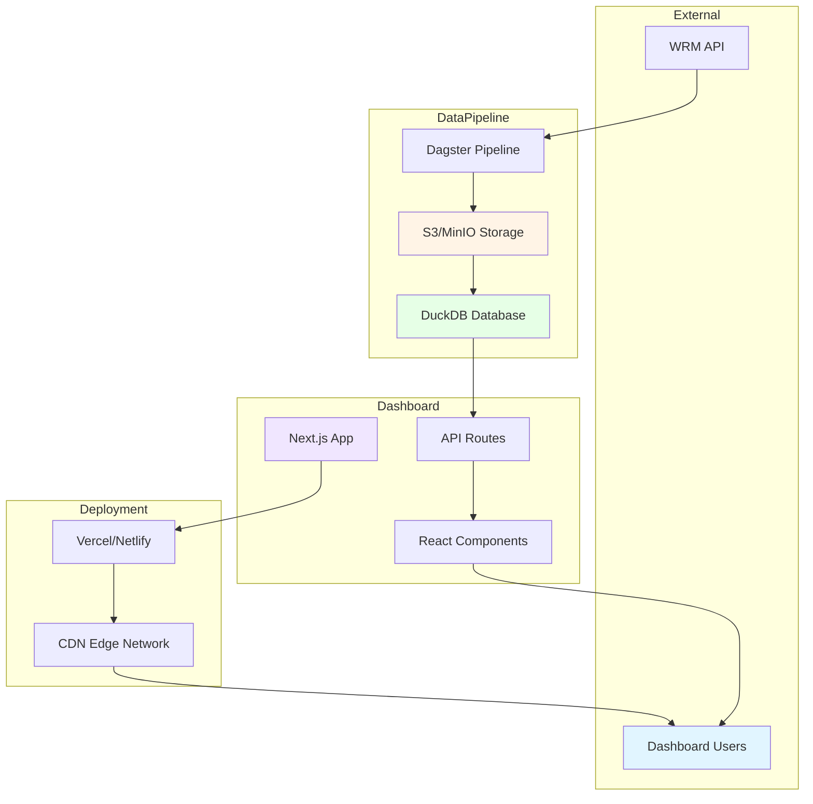
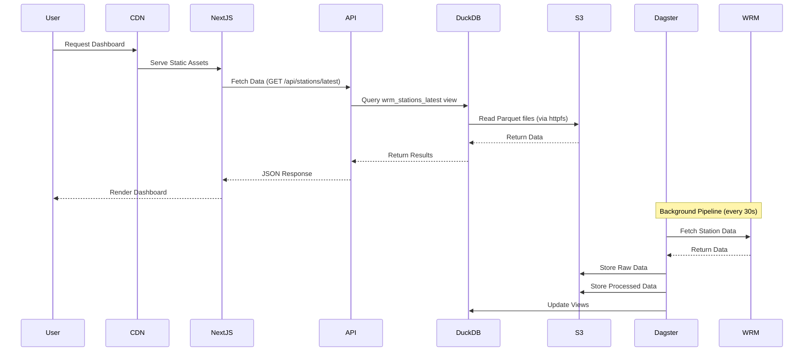
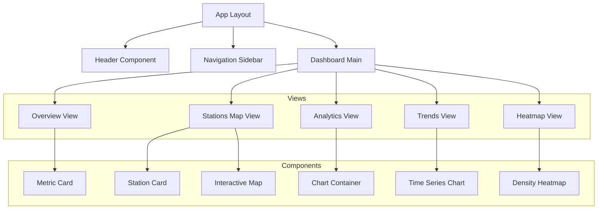
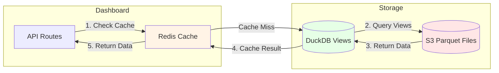
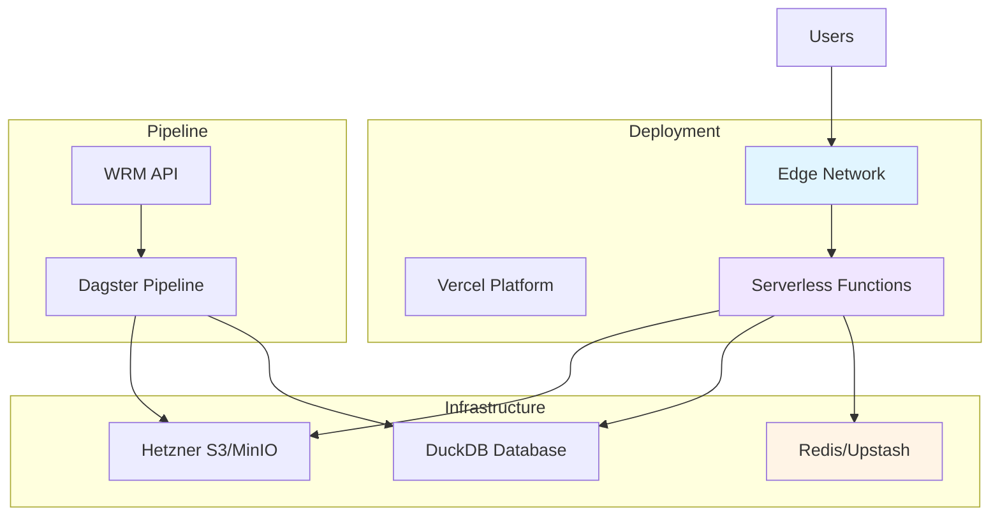

# Bike Data Flow Dashboard Architecture

## Executive Summary

This document outlines the architecture for an internet-accessible web dashboard for the Wrocław WRM bike-sharing system. The dashboard provides real-time and historical analytics visualization, leveraging the existing Dagster-based data pipeline with DuckDB and S3/MinIO storage.

**Key Design Decisions:**
- **Public Access**: No authentication required
- **Serverless Deployment**: Next.js frontend with Vercel/Netlify deployment
- **Data Refresh Strategy**: Tiered refresh intervals (30s for critical, 5m for standard, 1h for background)
- **Technology Stack**: Next.js 14+ (App Router), React, Plotly.js, DuckDB

---

## 1. System Overview

### 1.1 High-Level Architecture



### 1.2 Data Flow



---

## 2. Backend API Layer

### 2.1 Technology Stack

**Framework**: Next.js 14+ App Router with Route Handlers

**Rationale**:
- Serverless functions built-in
- TypeScript support
- Edge runtime support for global deployment
- Automatic API route generation
- Seamless frontend-backend integration

### 2.2 API Endpoints

#### 2.2.1 Station Data Endpoints

| Endpoint | Method | Description | Cache TTL |
|----------|--------|-------------|------------|
| `/api/stations/latest` | GET | Current status of all stations | 30s |
| `/api/stations/:id` | GET | Details for specific station | 30s |
| `/api/stations/history/:id` | GET | Historical data for station | 5m |
| `/api/stations/summary` | GET | Aggregated station statistics | 1m |

#### 2.2.2 Analytics Endpoints

| Endpoint | Method | Description | Cache TTL |
|----------|--------|-------------|------------|
| `/api/analytics/density` | GET | Bike density spatial analysis | 5m |
| `/api/analytics/trends` | GET | Temporal trends and patterns | 15m |
| `/api/analytics/heatmap` | GET | Heatmap data for visualization | 5m |
| `/api/analytics/kpis` | GET | Key performance indicators | 1m |

#### 2.2.3 System Endpoints

| Endpoint | Method | Description | Cache TTL |
|----------|--------|-------------|------------|
| `/api/health` | GET | Health check and status | 10s |
| `/api/metadata` | GET | Dashboard metadata and config | 1h |

### 2.3 API Response Format

```typescript
// Standard API Response
interface ApiResponse<T> {
  data: T;
  metadata: {
    timestamp: string;
    cache_ttl: number;
    data_freshness: string;
  };
}

// Station Data Response
interface Station {
  station_id: string;
  name: string;
  lat: number;
  lon: number;
  bikes: number;
  spaces: number;
  total_docks: number;
  installed: boolean;
  locked: boolean;
  temporary: boolean;
  pedelecs: number;
  last_updated: string;
}

// Analytics Response
interface DensityData {
  grid_squares: GridSquare[];
  total_bikes: number;
  total_stations: number;
  spatial_bounds: BoundingBox;
}
```

### 2.4 DuckDB Connection Management

```typescript
// lib/duckdb.ts
import duckdb from 'duckdb';

const DB_PATH = process.env.DUCKDB_PATH || './db/analytics.duckdb';

export function getDuckDBConnection() {
  const conn = duckdb.connect(DB_PATH);

  // Configure S3 access
  conn.exec(`
    INSTALL httpfs;
    LOAD httpfs;
    SET s3_region='auto';
    SET s3_access_key_id='${process.env.S3_ACCESS_KEY_ID}';
    SET s3_secret_access_key='${process.env.S3_SECRET_ACCESS_KEY}';
    SET s3_endpoint='${process.env.S3_ENDPOINT}';
    SET s3_use_ssl='true';
    SET s3_url_style='path';
  `);

  return conn;
}
```

### 2.5 Caching Strategy

**Multi-Layer Caching Approach**:

1. **Edge Caching (Vercel Edge Network)**
   - Static assets: 1 year with content hash
   - API responses: Configurable per endpoint
   - Cache headers: `Cache-Control: public, s-maxage=30, stale-while-revalidate=60`

2. **Application Caching (Redis/Upstash)**
   - Critical data: 30 seconds
   - Standard data: 5 minutes
   - Background data: 1 hour

3. **Browser Caching**
   - Static assets: 1 year
   - API responses: No caching (handled by edge)

```typescript
// Cache configuration per endpoint
const CACHE_CONFIG = {
  '/api/stations/latest': { edge: 30, redis: 30 },
  '/api/analytics/density': { edge: 300, redis: 300 },
  '/api/analytics/trends': { edge: 900, redis: 900 },
  '/api/health': { edge: 10, redis: 10 },
};
```

### 2.6 Rate Limiting

**Strategy**: Token bucket algorithm via Vercel Edge Config

```typescript
// middleware.ts
import { Ratelimit } from '@upstash/ratelimit';
import { Redis } from '@upstash/redis';

const ratelimit = new Ratelimit({
  redis: Redis.fromEnv(),
  limiter: Ratelimit.slidingWindow(100, '1m'), // 100 requests per minute
  analytics: true,
});

export async function middleware(request: Request) {
  const ip = request.headers.get('x-forwarded-for') ?? 'anonymous';
  const { success } = await ratelimit.limit(ip);

  if (!success) {
    return new Response('Too Many Requests', { status: 429 });
  }
}
```

### 2.7 Error Handling

```typescript
// lib/errors.ts
export class APIError extends Error {
  constructor(
    message: string,
    public statusCode: number = 500,
    public code: string = 'INTERNAL_ERROR'
  ) {
    super(message);
  }
}

export class DatabaseError extends APIError {
  constructor(message: string) {
    super(message, 503, 'DATABASE_ERROR');
  }
}

export class NotFoundError extends APIError {
  constructor(resource: string) {
    super(`${resource} not found`, 404, 'NOT_FOUND');
  }
}
```

---

## 3. Frontend Dashboard

### 3.1 Technology Stack

| Component | Technology | Rationale |
|-----------|------------|-----------|
| Framework | Next.js 14+ (App Router) | Server-side rendering, API routes, TypeScript |
| UI Library | shadcn/ui + Tailwind CSS | Modern, accessible, customizable |
| State Management | Zustand | Lightweight, simple API |
| Data Fetching | SWR | Automatic revalidation, caching |
| Visualization | Plotly.js + React-Plotly.js | Interactive maps, 3D support |
| Maps | Mapbox GL JS or Leaflet | High-performance mapping |

### 3.2 Component Architecture



### 3.3 Dashboard Views

#### 3.3.1 Overview View
- KPI cards (total bikes, available docks, active stations)
- Quick stats summary
- System health indicators
- Last updated timestamp

#### 3.3.2 Stations Map View
- Interactive map with station markers
- Station details on hover/click
- Real-time availability indicators
- Color-coded by bike availability

#### 3.3.3 Analytics View
- Bike density heatmap
- Spatial distribution charts
- Station utilization metrics
- Peak hours analysis

#### 3.3.4 Trends View
- Time series charts for bike availability
- Historical trends
- Comparison views (day/week/month)
- Forecast indicators

#### 3.3.5 Heatmap View
- 1000m² grid square visualization
- Color-coded density
- Interactive tooltips
- Time-lapse animation option

### 3.4 Data Fetching Strategy

```typescript
// hooks/useStations.ts
import useSWR from 'swr';

const fetcher = async (url: string) => {
  const res = await fetch(url);
  if (!res.ok) throw new Error('Failed to fetch');
  return res.json();
};

export function useStationsLatest() {
  return useSWR('/api/stations/latest', fetcher, {
    refreshInterval: 30000, // 30 seconds
    revalidateOnFocus: false,
    revalidateOnReconnect: true,
  });
}

export function useStationHistory(id: string) {
  return useSWR(`/api/stations/history/${id}`, fetcher, {
    refreshInterval: 300000, // 5 minutes
    revalidateOnFocus: false,
  });
}
```

### 3.5 Real-Time Data Refresh

**Strategy**: Polling with SWR (no WebSocket needed for public dashboard)

```typescript
// components/AutoRefresh.tsx
import { useEffect, useState } from 'react';

export function AutoRefresh({ interval = 30000 }) {
  const [lastRefresh, setLastRefresh] = useState<Date>(new Date());
  const [isPaused, setIsPaused] = useState(false);

  useEffect(() => {
    if (isPaused) return;

    const timer = setInterval(() => {
      setLastRefresh(new Date());
      // SWR handles automatic revalidation
    }, interval);

    return () => clearInterval(timer);
  }, [interval, isPaused]);

  return (
    <div className="flex items-center gap-2">
      <div className={`w-2 h-2 rounded-full ${isPaused ? 'bg-yellow-500' : 'bg-green-500'}`} />
      <span className="text-sm text-gray-600">
        Last updated: {lastRefresh.toLocaleTimeString()}
      </span>
      <button
        onClick={() => setIsPaused(!isPaused)}
        className="text-xs underline"
      >
        {isPaused ? 'Resume' : 'Pause'}
      </button>
    </div>
  );
}
```

### 3.6 Visualization Components

#### 3.6.1 Interactive Map (Plotly.js)

```typescript
// components/StationsMap.tsx
import Plot from 'react-plotly.js';

interface StationsMapProps {
  stations: Station[];
  onStationClick?: (station: Station) => void;
}

export function StationsMap({ stations, onStationClick }: StationsMapProps) {
  const data = [
    {
      type: 'scattermapbox',
      lat: stations.map(s => s.lat),
      lon: stations.map(s => s.lon),
      mode: 'markers',
      marker: {
        size: stations.map(s => Math.sqrt(s.bikes) * 5),
        color: stations.map(s => s.bikes),
        colorscale: 'RdYlGn',
        showscale: true,
        colorbar: { title: 'Available Bikes' },
      },
      text: stations.map(s => s.name),
      hovertemplate: '<b>%{text}</b><br>Bikes: %{marker.color}<extra></extra>',
    },
  ];

  const layout = {
    mapbox: {
      style: 'open-street-map',
      center: { lat: 51.1079, lon: 17.0385 }, // Wrocław center
      zoom: 12,
    },
    margin: { l: 0, r: 0, t: 0, b: 0 },
    height: 600,
  };

  return <Plot data={data} layout={layout} onClick={onStationClick} />;
}
```

#### 3.6.2 Time Series Chart

```typescript
// components/TimeSeriesChart.tsx
import Plot from 'react-plotly.js';

interface TimeSeriesChartProps {
  data: { timestamp: string; value: number }[];
  title: string;
}

export function TimeSeriesChart({ data, title }: TimeSeriesChartProps) {
  const plotData = [
    {
      x: data.map(d => d.timestamp),
      y: data.map(d => d.value),
      type: 'scatter',
      mode: 'lines+markers',
      name: title,
      line: { shape: 'spline' },
    },
  ];

  const layout = {
    title,
    xaxis: { title: 'Time' },
    yaxis: { title: 'Count' },
    responsive: true,
  };

  return <Plot data={plotData} layout={layout} useResizeHandler />;
}
```

---

## 4. Data Flow Architecture

### 4.1 Data Access Patterns



### 4.2 Query Optimization

**DuckDB Query Patterns**:

```sql
-- Latest stations (optimized with materialized view)
CREATE OR REPLACE VIEW wrm_stations_latest AS
SELECT *
FROM (
    SELECT *,
           ROW_NUMBER() OVER (PARTITION BY station_id 
                             ORDER BY date DESC, file_timestamp DESC) as rn
    FROM wrm_stations_enhanced_data
    WHERE record_type = 'station'
) t
WHERE rn = 1;

-- Spatial density query (pre-computed)
CREATE OR REPLACE VIEW wrm_density_grid AS
SELECT 
    grid_lat,
    grid_lon,
    bike_count,
    station_count,
    density_per_1000m2
FROM bike_density_spatial_analysis;
```

**Connection Pooling**:

```typescript
// lib/duckdb-pool.ts
import { Pool } from 'generic-pool';

const pool = Pool({
  create: () => getDuckDBConnection(),
  destroy: (conn) => conn.close(),
  max: 10,
  min: 2,
  idleTimeoutMillis: 30000,
});

export async function queryDuckDB(sql: string, params: any[] = []) {
  const conn = await pool.acquire();
  try {
    return conn.all(sql, ...params);
  } finally {
    pool.release(conn);
  }
}
```

### 4.3 Data Freshness Strategy

**Tiered Refresh Intervals** (based on research and best practices):

| Data Type | Refresh Interval | Rationale |
|------------|------------------|------------|
| Critical Metrics (latest stations) | 30 seconds | Aligns with Dagster sensor interval |
| Standard Analytics (density, trends) | 5 minutes | Balance freshness and performance |
| Background Data (historical) | 1 hour | Low volatility, resource-intensive |
| Static Metadata | 1 day | Rarely changes |

**Smart Refresh Logic**:

```typescript
// lib/smart-refresh.ts
export function shouldRefresh(
  lastUpdate: Date,
  dataType: 'critical' | 'standard' | 'background'
): boolean {
  const now = new Date();
  const intervals = {
    critical: 30000,    // 30 seconds
    standard: 300000,   // 5 minutes
    background: 3600000, // 1 hour
  };

  const elapsed = now.getTime() - lastUpdate.getTime();
  return elapsed >= intervals[dataType];
}

export function getRefreshInterval(dataType: string): number {
  const intervals: Record<string, number> = {
    '/api/stations/latest': 30000,
    '/api/analytics/density': 300000,
    '/api/analytics/trends': 900000,
  };
  return intervals[dataType] || 60000; // Default 1 minute
}
```

---

## 5. Deployment Architecture

### 5.1 Serverless Deployment Strategy



### 5.2 Deployment Configuration

**Vercel Configuration** (`vercel.json`):

```json
{
  "buildCommand": "npm run build",
  "outputDirectory": ".next",
  "framework": "nextjs",
  "regions": ["fra1", "waw1"],
  "functions": {
    "app/api/**/*.ts": {
      "maxDuration": 30,
      "memory": 1024
    }
  },
  "headers": [
    {
      "source": "/api/(.*)",
      "headers": [
        {
          "key": "Cache-Control",
          "value": "public, s-maxage=30, stale-while-revalidate=60"
        }
      ]
    },
    {
      "source": "/static/(.*)",
      "headers": [
        {
          "key": "Cache-Control",
          "value": "public, max-age=31536000, immutable"
        }
      ]
    }
  ]
}
```

**Environment Variables**:

```bash
# S3/MinIO Configuration
S3_ENDPOINT_URL=https://your-hetzner-endpoint.com
S3_ACCESS_KEY_ID=your-access-key
S3_SECRET_ACCESS_KEY=your-secret-key
S3_REGION=auto
BUCKET_NAME=bike-data

# DuckDB Configuration
DUCKDB_PATH=./db/analytics.duckdb

# Redis Configuration (Upstash)
REDIS_URL=redis://your-redis-url

# Application Configuration
NEXT_PUBLIC_APP_URL=https://your-dashboard.vercel.app
NEXT_PUBLIC_MAPBOX_TOKEN=your-mapbox-token
```

### 5.3 SSL/TLS Setup

**Automatic HTTPS**:
- Vercel provides automatic SSL certificates via Let's Encrypt
- No manual configuration required
- Automatic certificate renewal

**Custom Domain**:
```bash
# Add custom domain via Vercel CLI
vercel domains add dashboard.bike-data.wroclaw.pl
```

### 5.4 CDN Configuration

**Vercel Edge Network**:
- Automatic CDN deployment
- 100+ edge locations worldwide
- Smart routing based on user location

**Static Asset Optimization**:
- Image optimization via `next/image`
- Font optimization via `next/font`
- CSS minification and purging

### 5.5 Monitoring and Observability

**Vercel Analytics**:
- Real-time performance metrics
- Error tracking
- Web Vitals monitoring

**Custom Monitoring**:

```typescript
// lib/monitoring.ts
export function logApiCall(endpoint: string, duration: number) {
  // Send to analytics service
  console.log(`API Call: ${endpoint} - ${duration}ms`);
}

export function logError(error: Error, context: any) {
  // Send to error tracking service
  console.error('Error:', error, context);
}
```

---

## 6. Scalability Considerations

### 6.1 Database Optimization

**DuckDB Optimization Strategies**:

1. **Materialized Views**:
```sql
-- Pre-compute expensive queries
CREATE MATERIALIZED VIEW mv_station_latest AS
SELECT * FROM wrm_stations_latest;

-- Refresh strategy
REFRESH MATERIALIZED VIEW mv_station_latest;
```

2. **Query Caching**:
```typescript
// lib/query-cache.ts
const queryCache = new Map<string, { data: any; timestamp: number }>();

export async function cachedQuery(
  key: string,
  query: () => Promise<any>,
  ttl: number
) {
  const cached = queryCache.get(key);
  if (cached && Date.now() - cached.timestamp < ttl) {
    return cached.data;
  }

  const data = await query();
  queryCache.set(key, { data, timestamp: Date.now() });
  return data;
}
```

3. **Connection Pooling**:
- Reuse DuckDB connections
- Limit concurrent queries
- Implement connection timeouts

### 6.2 CDN for Static Assets

**Asset Optimization**:

```typescript
// next.config.js
module.exports = {
  images: {
    domains: ['your-cdn-domain.com'],
    formats: ['image/avif', 'image/webp'],
  },
  compress: true,
  swcMinify: true,
};
```

### 6.3 Load Balancing

**Serverless Auto-Scaling**:
- Vercel automatically scales based on traffic
- No manual load balancer configuration needed
- Edge routing for optimal performance

**Regional Deployment**:
```json
{
  "regions": ["fra1", "waw1", "ams1"]
}
```

### 6.4 Performance Optimization

**Code Splitting**:
```typescript
// Dynamic imports for heavy components
const MapComponent = dynamic(() => import('./components/MapComponent'), {
  loading: () => <MapSkeleton />,
  ssr: false,
});
```

**Image Optimization**:
```typescript
import Image from 'next/image';

<Image
  src="/station-icon.png"
  alt="Station"
  width={32}
  height={32}
  priority={false}
/>
```

**Bundle Size Optimization**:
```typescript
// Tree-shaking for Plotly
import Plot from 'react-plotly.js';
// Only import required Plotly modules
```

---

## 7. Security Considerations

### 7.1 Public Dashboard Security

**CORS Configuration**:
```typescript
// middleware.ts
export const config = {
  matcher: '/api/:path*',
};

export function middleware(request: Request) {
  const response = NextResponse.next();
  
  response.headers.set('Access-Control-Allow-Origin', '*');
  response.headers.set('Access-Control-Allow-Methods', 'GET, OPTIONS');
  response.headers.set('Access-Control-Allow-Headers', 'Content-Type');
  
  return response;
}
```

**Rate Limiting**:
- 100 requests per minute per IP
- Token bucket algorithm
- Automatic blocking for abuse

**Input Validation**:
```typescript
// lib/validation.ts
import { z } from 'zod';

export const StationIdSchema = z.string().regex(/^station_\d+$/);
export const DateRangeSchema = z.object({
  start: z.string().datetime(),
  end: z.string().datetime(),
});

export function validateStationId(id: string) {
  return StationIdSchema.parse(id);
}
```

### 7.2 Environment Variable Security

**Secret Management**:
- Use Vercel Environment Variables
- Never commit secrets to git
- Rotate credentials regularly

**S3 Access**:
- Read-only access for dashboard
- Separate credentials for pipeline
- IP whitelisting if needed

---

## 8. Implementation Roadmap

### Phase 1: Foundation
1. Set up Next.js project with TypeScript
2. Configure Vercel deployment
3. Set up DuckDB connection layer
4. Implement basic API endpoints
5. Create dashboard layout

### Phase 2: Core Features
1. Implement stations map view
2. Add real-time data refresh
3. Create analytics views
4. Implement caching layer
5. Add error handling

### Phase 3: Advanced Features
1. Add time series charts
2. Implement heatmap visualization
3. Add trends analysis
4. Optimize performance
5. Add monitoring

### Phase 4: Production
1. Set up custom domain
2. Configure SSL
3. Implement rate limiting
4. Add analytics
5. Performance tuning

---

## 9. Technology Summary

| Layer | Technology | Purpose |
|-------|------------|---------|
| Frontend | Next.js 14+ | React framework with SSR |
| UI | shadcn/ui + Tailwind CSS | Component library |
| State | Zustand | State management |
| Data Fetching | SWR | Data fetching and caching |
| Visualization | Plotly.js | Interactive charts and maps |
| Backend API | Next.js Route Handlers | Serverless API |
| Database | DuckDB | Analytical database |
| Storage | S3/MinIO | Object storage |
| Cache | Redis/Upstash | Application caching |
| Deployment | Vercel | Serverless hosting |
| CDN | Vercel Edge Network | Global CDN |
| Monitoring | Vercel Analytics | Performance monitoring |

---

## 10. Appendix

### 10.1 DuckDB Views Reference

| View Name | Description | Use Case |
|-----------|-------------|----------|
| `wrm_stations_enhanced_data` | All enhanced data | Historical analysis |
| `wrm_stations_only` | Station records only | Station-level metrics |
| `wrm_bikes_only` | Bike records only | Bike tracking |
| `wrm_stations_latest` | Latest station status | Real-time dashboard |

### 10.2 API Response Examples

**GET /api/stations/latest**:
```json
{
  "data": [
    {
      "station_id": "station_1",
      "name": "Rynek",
      "lat": 51.1079,
      "lon": 17.0385,
      "bikes": 12,
      "spaces": 8,
      "total_docks": 20,
      "installed": true,
      "locked": false,
      "temporary": false,
      "pedelecs": 3,
      "last_updated": "2025-01-09T17:00:00Z"
    }
  ],
  "metadata": {
    "timestamp": "2025-01-09T17:00:30Z",
    "cache_ttl": 30,
    "data_freshness": "30 seconds old"
  }
}
```

### 10.3 Performance Targets

| Metric | Target | Measurement |
|--------|--------|-------------|
| API Response Time | < 500ms | p95 latency |
| Page Load Time | < 2s | First Contentful Paint |
| Time to Interactive | < 3s | TTI |
| Cache Hit Rate | > 80% | Edge cache |
| Error Rate | < 0.1% | 5xx errors |

---

*Document Version: 1.0*
*Last Updated: 2025-01-09*
*Author: Architecture Team*
