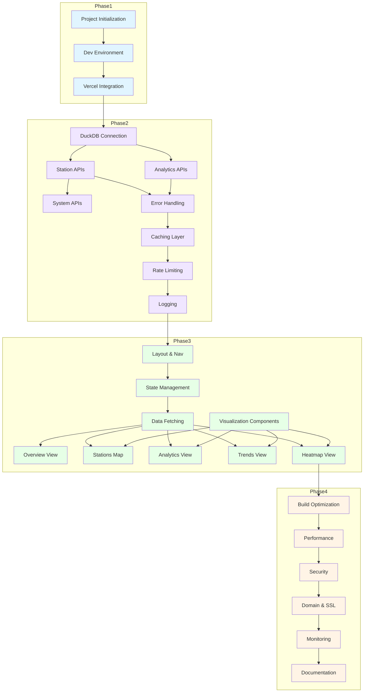

# Bike Data Flow Dashboard - Implementation Task Plan

## Project Overview

**Goal**: Build a production-ready web dashboard for the Wrocław WRM bike-sharing system with real-time analytics visualization.

**Architecture Reference**: [`dashboard-architecture.md`](dashboard-architecture.md)

**Technology Stack**:
- Frontend: Next.js 14+ (App Router), React, Plotly.js, shadcn/ui + Tailwind CSS
- Backend: Next.js API Routes with DuckDB integration
- Deployment: Vercel serverless
- Caching: Upstash Redis
- Data: Existing DuckDB views and S3/MinIO storage

---

## Phase 1: Foundation Setup

### 1.1 Project Initialization
- [ ] Create Next.js 14+ project with TypeScript and App Router
- [ ] Install core dependencies: `@upstash/redis`, `duckdb`, `react-plotly.js`, `swr`, `zustand`, `zod`
- [ ] Configure Tailwind CSS with shadcn/ui components
- [ ] Set up project structure following Next.js best practices
- [ ] Create `.env.example` with all required environment variables
- [ ] Configure TypeScript strict mode and path aliases

### 1.2 Development Environment
- [ ] Set up ESLint and Prettier with Next.js recommended configs
- [ ] Configure Git pre-commit hooks (husky + lint-staged)
- [ ] Create `.gitignore` for Next.js project
- [ ] Set up local development scripts in `package.json`

### 1.3 Vercel Integration
- [ ] Install Vercel CLI globally
- [ ] Initialize Vercel project with `vercel` command
- [ ] Configure `vercel.json` with build settings and function configurations
- [ ] Set up environment variables in Vercel dashboard
- [ ] Configure deployment regions (fra1, waw1 for European users)

---

## Phase 2: Backend API Layer

### 2.1 DuckDB Connection Layer
- [ ] Create `lib/duckdb.ts` with connection management
- [ ] Configure DuckDB HTTPFS extension for S3/MinIO access
- [ ] Implement connection pooling with `generic-pool`
- [ ] Create DuckDB query utility functions
- [ ] Add error handling for database connection failures

### 2.2 Core API Endpoints - Stations
- [ ] Create `app/api/stations/latest/route.ts` - GET endpoint for current station status
- [ ] Create `app/api/stations/[id]/route.ts` - GET endpoint for specific station
- [ ] Create `app/api/stations/history/[id]/route.ts` - GET endpoint for station history
- [ ] Create `app/api/stations/summary/route.ts` - GET endpoint for aggregated statistics
- [ ] Implement response format with metadata (timestamp, cache_ttl, data_freshness)

### 2.3 Core API Endpoints - Analytics
- [ ] Create `app/api/analytics/density/route.ts` - GET endpoint for spatial density
- [ ] Create `app/api/analytics/trends/route.ts` - GET endpoint for temporal trends
- [ ] Create `app/api/analytics/heatmap/route.ts` - GET endpoint for heatmap data
- [ ] Create `app/api/analytics/kpis/route.ts` - GET endpoint for KPIs

### 2.4 System Endpoints
- [ ] Create `app/api/health/route.ts` - Health check endpoint
- [ ] Create `app/api/metadata/route.ts` - Dashboard metadata endpoint

### 2.5 Error Handling & Validation
- [ ] Create `lib/errors.ts` with custom error classes (APIError, DatabaseError, NotFoundError)
- [ ] Create `lib/validation.ts` with Zod schemas for input validation
- [ ] Implement global error handler for API routes
- [ ] Add request ID generation in middleware for tracing

### 2.6 Caching Layer
- [ ] Install and configure `@upstash/redis` package
- [ ] Create `lib/cache.ts` with Redis client setup
- [ ] Implement cache utility functions (get, set, invalidate)
- [ ] Create cache configuration per endpoint (TTL settings)
- [ ] Implement cache key generation strategy

### 2.7 Rate Limiting
- [ ] Install `@upstash/ratelimit` package
- [ ] Create `lib/ratelimit.ts` with rate limiting configuration
- [ ] Implement middleware for rate limiting (100 req/min per IP)
- [ ] Add rate limit headers to API responses

### 2.8 Logging & Monitoring
- [ ] Install `pino` logger
- [ ] Create `lib/logger.ts` with structured logging configuration
- [ ] Implement request logging in API routes
- [ ] Add performance metrics logging (duration, status codes)
- [ ] Set up error tracking with structured logs

---

## Phase 3: Frontend Dashboard

### 3.1 Layout & Navigation
- [ ] Create root layout with header and sidebar navigation
- [ ] Implement responsive navigation menu
- [ ] Create dashboard shell component
- [ ] Add auto-refresh indicator component

### 3.2 State Management
- [ ] Create Zustand store for global state
- [ ] Implement station selection state
- [ ] Add filter preferences state
- [ ] Create UI theme state (dark/light mode)

### 3.3 Data Fetching Hooks
- [ ] Create `hooks/useStations.ts` with SWR for station data
- [ ] Create `hooks/useAnalytics.ts` with SWR for analytics data
- [ ] Implement refresh intervals (30s for critical, 5m for standard)
- [ ] Add error handling and retry logic

### 3.4 Overview View
- [ ] Create `app/dashboard/overview/page.tsx`
- [ ] Implement KPI cards (total bikes, available docks, active stations)
- [ ] Add system health indicators
- [ ] Create last updated timestamp display

### 3.5 Stations Map View
- [ ] Create `app/dashboard/stations/page.tsx`
- [ ] Implement `components/StationsMap.tsx` with Plotly.js scattermapbox
- [ ] Add station markers with color-coded availability
- [ ] Implement station details on hover/click
- [ ] Create `components/StationCard.tsx` for station details

### 3.6 Analytics View
- [ ] Create `app/dashboard/analytics/page.tsx`
- [ ] Implement bike density heatmap visualization
- [ ] Add spatial distribution charts
- [ ] Create station utilization metrics display
- [ ] Implement peak hours analysis chart

### 3.7 Trends View
- [ ] Create `app/dashboard/trends/page.tsx`
- [ ] Implement time series charts for bike availability
- [ ] Add historical trends visualization
- [ ] Create comparison views (day/week/month)
- [ ] Implement forecast indicators

### 3.8 Heatmap View
- [ ] Create `app/dashboard/heatmap/page.tsx`
- [ ] Implement 1000m² grid square visualization
- [ ] Add color-coded density display
- [ ] Create interactive tooltips
- [ ] Implement time-lapse animation option

### 3.9 Visualization Components
- [ ] Create `components/TimeSeriesChart.tsx` with Plotly.js
- [ ] Create `components/DensityHeatmap.tsx` with Plotly.js
- [ ] Implement chart container with loading states
- [ ] Add responsive chart resizing
- [ ] Optimize Plotly.js bundle size (tree-shaking)
- [ ] Implement data sampling utility for large datasets (max 10K points)
- [ ] Configure Plotly.js to use WebGL rendering for better performance
- [ ] Implement virtual scrolling for long station lists
- [ ] Add lazy loading for chart data on scroll
- [ ] Implement data aggregation for time series views (hourly/daily/weekly)

---

## Phase 4: Production Deployment

### 4.1 Build Optimization
- [ ] Configure `next.config.js` with image optimization
- [ ] Enable SWC minification
- [ ] Implement code splitting for heavy components
- [ ] Configure bundle size analysis
- [ ] Optimize Plotly.js imports

### 4.2 Performance Optimization
- [ ] Implement dynamic imports for map components
- [ ] Add image optimization with `next/image`
- [ ] Configure font optimization with `next/font`
- [ ] Implement lazy loading for charts
- [ ] Add skeleton loading states

### 4.3 Security Hardening
- [ ] Configure CORS headers in middleware
- [ ] Implement input validation on all endpoints
- [ ] Add security headers (CSP, X-Frame-Options)
- [ ] Review and secure environment variables
- [ ] Implement S3 read-only access credentials

### 4.4 Custom Domain & SSL
- [ ] Add custom domain in Vercel dashboard
- [ ] Configure DNS records
- [ ] Verify SSL certificate (automatic via Vercel)
- [ ] Set up domain redirects

### 4.5 Monitoring & Analytics
- [ ] Enable Vercel Analytics
- [ ] Set up error tracking (Sentry or similar)
- [ ] Configure performance monitoring
- [ ] Implement uptime monitoring
- [ ] Set up alerting for critical failures

### 4.6 Documentation
- [ ] Create README.md with setup instructions
- [ ] Document API endpoints with examples
- [ ] Create deployment guide
- [ ] Document environment variables
- [ ] Add troubleshooting guide

---

## Dependencies Between Tasks

---

## Acceptance Criteria

### Phase 1 Acceptance
- Next.js project builds successfully with no TypeScript errors
- Vercel deployment succeeds with environment variables configured
- Development environment runs locally with hot reload

### Phase 2 Acceptance
- All API endpoints return valid JSON responses
- DuckDB queries execute successfully with S3/MinIO data
- Caching layer reduces database query load
- Rate limiting prevents abuse
- Logs capture all requests and errors

### Phase 3 Acceptance
- All dashboard views render without errors
- Real-time data refresh works at configured intervals
- Plotly.js charts display correctly with interactive features
- Responsive design works on mobile and desktop

### Phase 4 Acceptance
- Application deploys to production without errors
- Custom domain is accessible with valid SSL
- Performance metrics meet targets (API < 500ms, Page Load < 2s)
- Monitoring and alerting are configured
- Documentation is complete and accurate

---

## Errors Encountered

| Error | Attempt | Resolution |
|-------|---------|------------|
| | | |

---

## Notes

- All tasks should be completed in order within each phase
- Dependencies between phases must be respected
- Each task should be tested before marking complete
- Update this plan as new requirements are discovered

---

*Last Updated: 2026-01-09*
*Status: Planning Phase*
